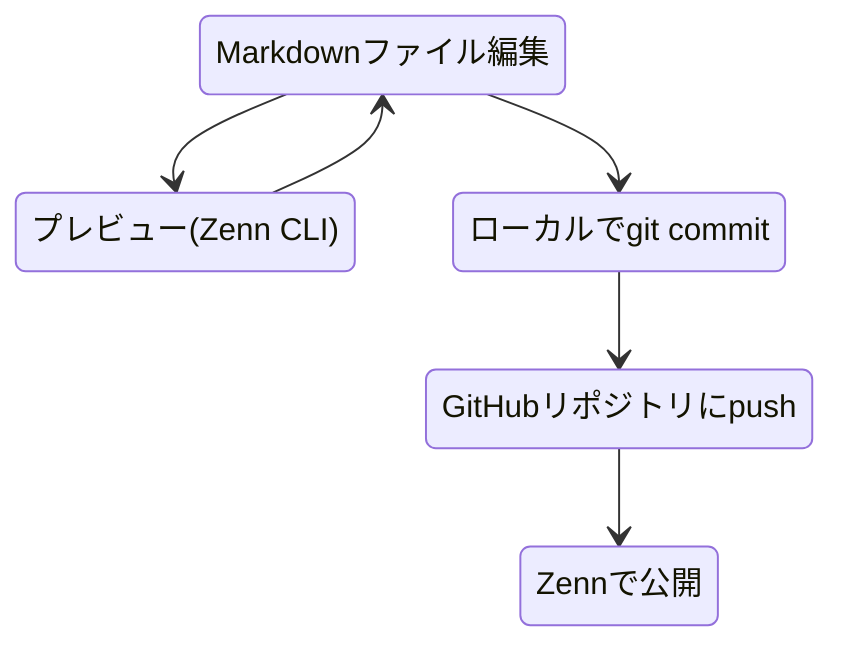
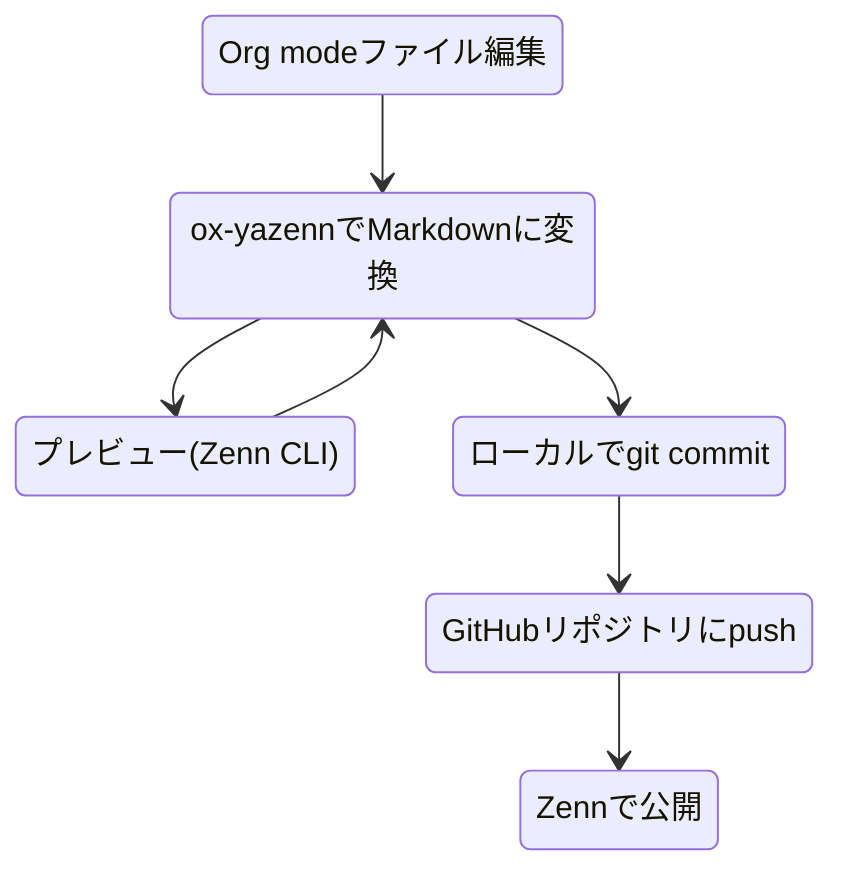

# コンテンツ公開までの一般的なフロー

Zennでは、GitHubリポジトリを介して投稿コンテンツを管理する方法が用意されています。
文書を記したMarkdownファイルをZennが指定するディレクトリ構成で配置して、GitHubにpushするという手順で投稿できます。
この方法を利用するには、ZennのダッシュボードからGitHubリポジトリ連携を行います。
詳しくは「[アカウントにGitHubリポジトリを連携してZennのコンテンツを管理する](https://zenn.dev/zenn/articles/connect-to-github)（Zenn公式）」を参照してください。

Zennが指定するディレクトリ構成は、「[Zenn CLIで記事・本を管理する方法](https://zenn.dev/zenn/articles/zenn-cli-guide)（Zenn公式）」に説明があります。Zenn CLIのインストールは必須ではありませんが、[Zenn CLIのプレビュー機能](https://zenn.dev/zenn/articles/zenn-cli-guide#%E3%83%97%E3%83%AC%E3%83%93%E3%83%A5%E3%83%BC%E3%81%99%E3%82%8B)は投稿前にMarkdownのレンダリング結果を確認できて便利です。同時に正しいディレクトリ構成になっているかも確認できます。インストール方法は「[Zenn CLIをインストールする](https://zenn.dev/zenn/articles/install-zenn-cli)（Zenn公式）」に説明があります。

# ox-yazennを利用した場合のフロー

`ox-yazenn` を利用すると、次のようなフローになります。

